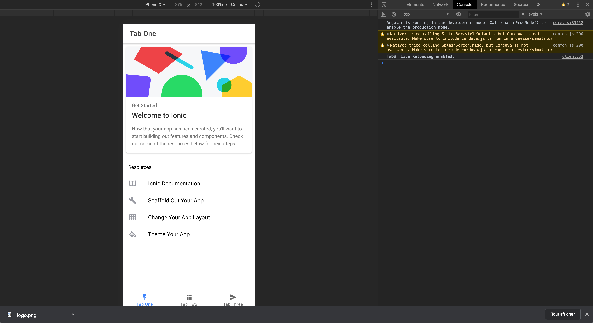

summary: Démarrer une appli Ionic
id: ionic-start
categories: Web
tags: ionic
status: Published
authors: Simon

# Démarrer une application Ionic

<!-- ------------------------ -->

## Initialisation

pour lancer un projet Ionic c'est très simple. Allez dans le dossier qui vous intéresse et lancez la commande suivante.

```bash
ionic start myApp blank
```

Si la CLI vous demande de choisir entre Angular et React, choisissez Angular. Si elle vous demande de choisir entre Capacitor et Capacitor, choisissez Capacitor.

Le processus va tourner quelques instants. Créer les fichiers et installer les dépendances avec npm.

Positive
: Ionic nous met également à disposition plusieurs templates d'app initial. Par exemple: `ionic start myApp tabs`

Vous avez maintenant un projet ionic vide que vous pouvez lancer avec la commande suivante.

Vous devriez maintenant pouvoir lancer les commandes suivantes

```bash
cd myApp/
ionic serve
```

Cette dernière commande va ouvrir votre projet dans votre navigateur.



<!-- ------------------------ -->

## Lancer l'application sur Android

Pour qu'il nous soit possible de build notre application, nous devons dire à Capacitor que notre application doit ajouter cette platform.

```bash
ionic build # nécessaire seulement la première fois pour que le dossier www soit créé
ionic capacitor add android
```

Positive
: Ajouter d'autre platforme comme IOS par exemple ce fait de la même manière mais nous nous concentrerons sur android ici.

Une fois cela fait, vous pouvez lancer votre application sur un device Android. Pour ce faire: Lancez les commandes suivantes

```bash
# Va build notre app Angular dans le dossier "www"
ionic build
# Copie le contenu de notre app buildé dans l'application Android
ionic capacitor sync android
```

Vous pouvez maintenant lancer votre application depuis Android Studio avec le bouton "Run App" (En haut à droite dans la barre d'outils)

<!-- ------------------------ -->

## Lancer l'app en mode Live Reload

C'est bien beau tout ça mais si on doit le refaire chaque fois qu'on fait un changement ça va vite être relou.

C'est pour ça qu'on veut lancer notre app en mode "Live Reload" (C'est à ça que va servir le package `native-run` que vous avez installé plus tôt avec NPM).

Pour ça ce n'est pas vraiment plus compliqué.

Commencez par changer la propriété `server` dans le fichier `capacitor.config.json` pour y rajouter la propriété `"cleartext": true`.

Exemple:

```json
{
  "appId": "io.ionic.starter",
  "appName": "test-capacitor",
  "bundledWebRuntime": false,
  "npmClient": "npm",
  "webDir": "www",
  "plugins": {
    "SplashScreen": {
      "launchShowDuration": 0
    }
  },
  "cordova": {},
  "server": {
    "cleartext": true
  }
}
```

Maintenant vous avez deux choses à faire.

- Lancez cette commande

```bash
ionic capacitor run android -l --external
```

- Redémarrez ensuite votre application sur Android Studio. Vous devriez voir votre application démarrer avec une petite notification `Using app server xxxxxxx`.

> **Comment ça marche ?**
>
> La commande que vous avez lancé juste avant va ouvrir un serveur web sur lequel le téléphone se connecte pour recevoir les changements dès qu'il sont enregistrés. De la même manière que le fait un `ionic serve` ou un `ng start` avec votre navigateur.

Negative
: Dans le cas d'un simulateur nous n'avons aucun problème vis à vis de ce serveur WEB car le simulateur utilise le réseau de votre ordinateur. Cependant dans le cas d'un device physique, vous devez vous assurez que les deux périphériques (ordinateur et device Android) sont sur le même réseau.

<!-- ------------------------ -->

## Les composants de Ionic

Ionic en lui même est très simple, souvenez vous en ! Ce n'est ni plus ni moins qu'un bootstrap moderne. La plupart du métier qui est exécuté au niveau natif de votre application (Création des platforme, build natif etc...) est fait par Capacitor.

Partant de la vous savez que Ionic vous mettra à disposition beaucoup de composants graphique avec une apparence d'application native, destinés à vous faciliter la tache.

Vous pouvez en retrouver la liste sur la documentation avec pour chacun, une description détaillé de son mode d'utilisation, de ses paramètre etc...

[Les composants Ionic](https://ionicframework.com/docs/components)

<!-- ------------------------ -->

## Créer de de nouveaux components

Ionic met à notre disposition une CLI puissante nous permettant de générer de nouveau écran facilement (De la même façon que angular avec `ng`).

Vous pouvez en retrouver toute la documentation ici:
[https://ionicframework.com/docs/cli](https://ionicframework.com/docs/cli)

La commande qui nous intéresse ici est la commande [generate](https://ionicframework.com/docs/cli/commands/generate)

```bash
# Exemple
ionic generate page pages/photo-gallery
ionic generate service services/photo/photo
```

Positive
: Servez vous en autant que possible pour générer vos composants. On vous met des outils entre les mains autant s'en servir, Ils font une parti du boulot à votre place !

<!-- ------------------------ -->

## Ajouter un plugin dans notre app

Pour ajouter un plugin à notre application, on passe une fois de plus par la `CLI`.

Tous les plugins disponibles sont indiquez dans la documentation et décrivent les instructions d'installation ainsi que les manières de les utiliser.

[Les plugins](https://ionicframework.com/docs/native) (Dans notre cas, dans la partie "Capacitor")

Negative
: Ne vous faites pas avoir. Le site propose des plugins "Community" ainsi que des plugins "Entreprise". Les "Entreprise" font parti d'un plan payant de Ionic que nous n'utiliseront pas.

Pour information le plugin que nous utilisont en cours est ici:
[Plugin Camera](https://capacitorjs.com/docs/apis/camera)
