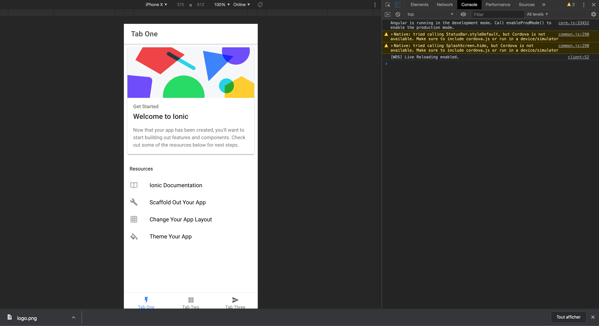

summary: The Ionic tour
id: ionic-tour
categories: Web
tags: ionic
status: Published
authors: Simon

# The Ionic tour

<!-- ------------------------ -->

## Initialisation

pour lancer un projet Ionic c'est très simple. Allez dans le dossier qui vous intéresse et lancez la commande suivante.

```bash
ionic start myApp blank
```

Si la CLI vous demande de choisir entre Angular et React, choisissez Angular. Si elle vous demande de choisir entre Cordova et Capacitor, choisissez Capacitor.

Le processus va tourner quelques instants. Créer les fichiers et installer les dépendances avec npm.

Positive
: Ionic nous met également à disposition plusieurs templates d'app initial. Par exemple: `ionic start myApp tabs`

Vous avez maintenant un projet ionic vide que vous pouvez lancer avec la commande suivante.

Vous devriez maintenant pouvoir lancer les commandes suivantes

```bash
cd myApp/
ionic serve
```

Cette dernière commande va ouvrir votre projet dans votre navigateur.



<!-- ------------------------ -->

## Les composants de Ionic

Ionic en lui même est très simple, souvenez vous en ! Ce n'est ni plus ni moins qu'un bootstrap moderne. La plupart du métier qui est exécuté au niveau natif de votre application (Création des platforme, build natif etc...) est fait par cordova.

Partant de la vous savez que Ionic vous mettra à disposition beaucoup de composants graphique avec une apparence d'application native, destinés à vous faciliter la tache.

Vous pouvez en retrouver la liste sur la documentation avec pour chacun, une description détaillé de son mode d'utilisation, de ses paramètre etc...

[Les composants Ionic](https://ionicframework.com/docs/components)

<!-- ------------------------ -->

## Créer de de nouveaux components

Ionic met à notre disposition une CLI puissante nous permettant de générer de nouveau écran facilement (De la même façon que angular avec `ng`).

Vous pouvez en retrouver toute la documentation ici:
[https://ionicframework.com/docs/cli](https://ionicframework.com/docs/cli)

La commande qui nous intéresse ici est la commande [generate](https://ionicframework.com/docs/cli/commands/generate)

```bash
# Exemple
ionic generate page pages/photo-gallery
ionic generate service services/photo/photo
```

Positive
: Servez vous en autant que possible pour générer vos composants. On vous met des outils entre les mains autant s'en servir, Ils font une parti du boulot à votre place !

<!-- ------------------------ -->

## Ajouter la platform android

Pour qu'il nous soit possible de build notre application, nous devons dire à cordova que notre application doit ajouter cette platform.

Nous utilisons une commande de cordova réimplémenté dans la CLI de ionic.

Negative
: Ici il faut bien noter que c'est Cordova qui va effectuer le travaille. La CLI de Ionic "redirige" juste la fonction par soucis de simplicité pour nous donner l'impression que nous n'utilisont qu'une seule CLI.

```bash
ionic cordova platform add android
```

Positive
: Ajouter d'autre platforme comme IOS par exemple ce fait de la même manière mais nous nous concentrerons sur android ici.

<!-- ------------------------ -->

## Ajouter un plugin dans notre app

Pour ajouter un plugin à notre application, on passe une fois de plus par la `CLI`.

Tous les plugins disponibles sont indiquez dans la documentation et décrivent les instructions d'installation ainsi que les manières de les utiliser.

[Les plugins](https://ionicframework.com/docs/native)

Negative
: Ne vous faites pas avoir. Le site propose des plugins "Community" ainsi que des plugins "Premier". Les "Premier" font parti d'un plan payant de Ionic que nous n'utiliseront pas.

Pour information le plugin que nous utilisont en cours est ici:
[Plugin Camera](https://ionicframework.com/docs/native/camera)
